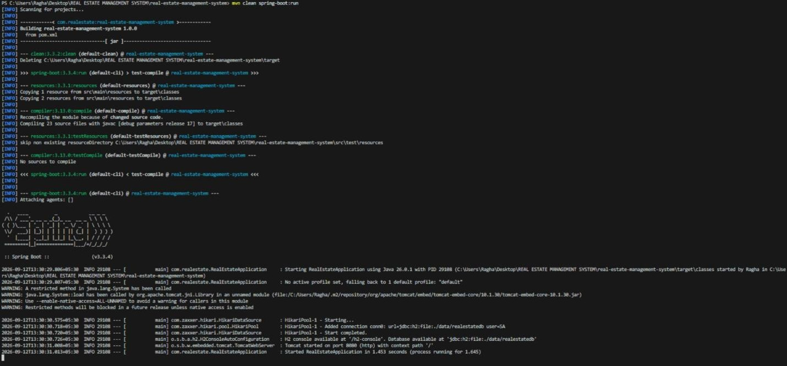
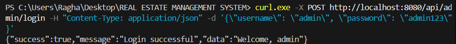
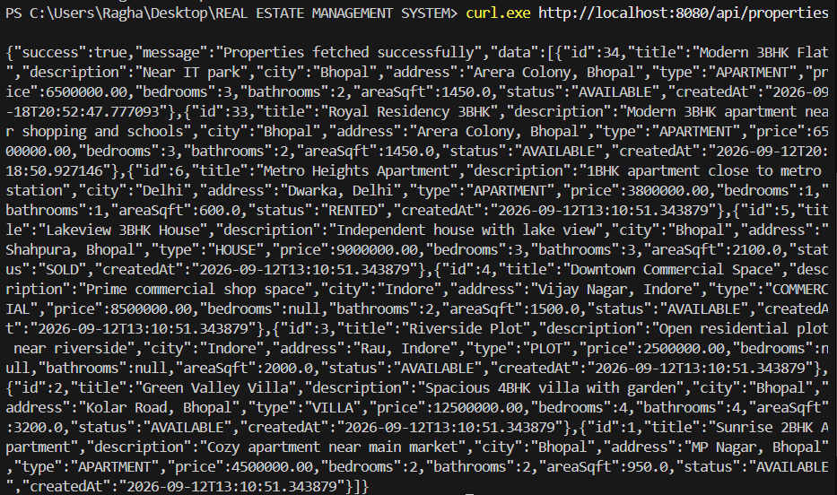
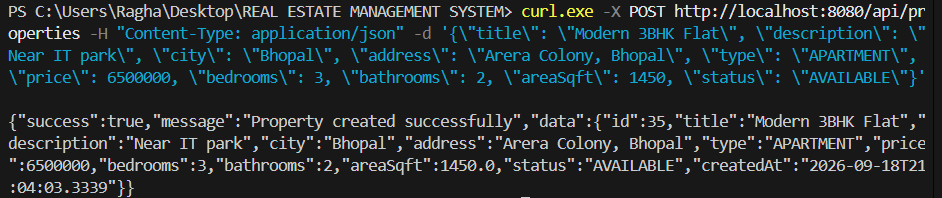
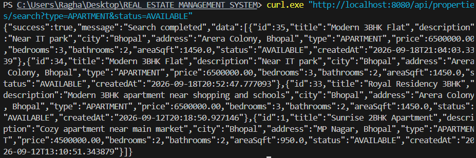
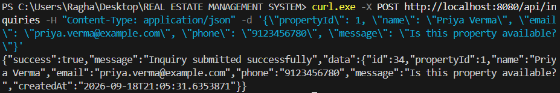
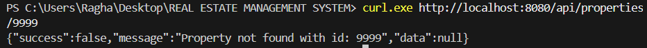
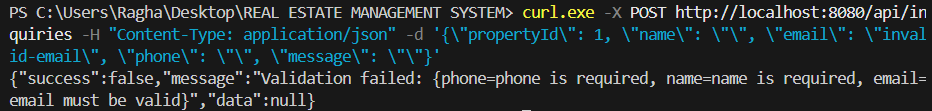

# Real Estate Management System

## Overview
This is a **backend-only REST API** for managing real estate property listings, built with **Spring Boot + JdbcTemplate + H2 (file-based database)**. It allows an admin to manage property records (add/update/delete/search) and allows customers to submit inquiries about a property. There is no frontend — it is meant to be tested entirely via the command line (curl) against the local server. The project follows a clean layered architecture (Controller → Service → DAO → Model) using plain JDBC (no JPA/Hibernate), so every SQL query is explicit and easy to follow.

> **This project is fully runnable and testable from the command line.** No GUI, IDE, browser, or graphical installer is required to build, run, or test it — everything works with plain terminal commands: `mvn spring-boot:run` to start the server on `localhost:8080`, and `curl` to send requests to it and see the JSON response, all inside the terminal.

## Features
- **Property CRUD** — create, read, update, delete property listings
- **Search** — filter properties by city, type, price range, bedrooms, and status
- **Admin login** — simple username/password check against the database
- **Inquiry module** — customers can submit inquiries for a specific property; admin can view all inquiries or inquiries per property
- **Persistent storage** — H2 is configured in file mode, so data survives an application restart
- **Consistent JSON responses** — every endpoint returns `{ success, message, data }`
- **Input validation** — invalid requests return clear `400` errors instead of crashing
- **Global exception handling** — clean JSON errors for not-found (`404`) and server errors (`500`)

## Technologies / Tools Used
| Category         | Tech |
|-------------------|------|
| Language           | Java 17 |
| Framework          | Spring Boot 3.3.4 |
| Data access        | Spring JDBC (`JdbcTemplate`) — no JPA/Hibernate |
| Database           | H2 (file-based, embedded) |
| Build tool         | Maven |
| Validation         | Jakarta Bean Validation |
| API testing        | curl (command line) |

## Project Layers
```
controller/   -> REST endpoints (HTTP in/out)
service/      -> business logic & validation
dao/          -> JdbcTemplate + raw SQL (only place that touches the DB)
model/        -> plain Java objects (POJOs)
dto/          -> request/response wrapper objects
exception/    -> custom exceptions + global error handler
```

## Folder Structure
```
real-estate-management-system/
├── pom.xml
├── src/main/java/com/realestate/
│   ├── RealEstateApplication.java
│   ├── controller/  (PropertyController, AdminController, InquiryController)
│   ├── service/     (interfaces + impl/)
│   ├── dao/          (interfaces + Impl classes using JdbcTemplate)
│   ├── model/        (Property, Admin, Inquiry)
│   ├── dto/          (ApiResponse, LoginRequest)
│   └── exception/    (ResourceNotFoundException, GlobalExceptionHandler)
└── src/main/resources/
    ├── application.properties
    ├── schema.sql
    └── data.sql
```

## Steps to Install & Run

### 1. Prerequisites
- JDK 17+
- Maven 3.6+ (or use your IDE's built-in Maven)

### 2. Clone and run
```bash
git clone https://github.com/raghav25bai10853/Real-Estate-Database-Management-System.git
cd Real-Estate-Database-Management-System
mvn spring-boot:run
```
Or build a runnable jar:
```bash
mvn clean package
java -jar target/real-estate-management-system.jar
```

The app starts on **http://localhost:8080**.

### 3. Where is my data stored?
This project uses **file-based H2** (not in-memory), configured in `application.properties`:
```properties
spring.datasource.url=jdbc:h2:file:./data/realestatedb;DB_CLOSE_ON_EXIT=FALSE
```
This creates a `data/realestatedb.mv.db` file next to your project. Stop the app, start it again — your data is still there. `schema.sql` and `data.sql` are written to be safe to re-run (they won't duplicate or wipe rows).

### 4. Default admin login
```
username: admin
password: admin123
```

---

## Instructions for Testing
Everything is tested from the command line against the locally running server — no GUI or browser required:
1. Start the app with `mvn spring-boot:run` (it starts listening on `http://localhost:8080`).
2. Open a second terminal window and run any `curl` command from the [API Reference](#api-reference) section below. Each command sends a request to the local server and prints the JSON response directly in the terminal.

**Suggested test flow:**
1. Start the app (`mvn spring-boot:run`).
2. `GET /api/properties` → should return the 6 sample properties already seeded from `data.sql`.
3. `POST /api/admin/login` with `admin` / `admin123` → should return success.
4. `POST /api/properties` with a new property → should return `201 Created` with the new property (including a generated `id`).
5. `GET /api/properties/search?city=Bhopal` → should return only Bhopal properties.
6. `POST /api/inquiries` with a valid `propertyId` → should succeed. Try an invalid `propertyId` (e.g. `9999`) → should return a clean `404` error.
7. Restart the app and repeat step 2 → the same data (plus anything you added) should still be there, proving persistence.

## Screenshots
#### Code Execution In The Terminal


#### LoggingIn


#### Getting Properties


#### Creating a Property


#### Searching a Property


#### Submitting an Inquiry


#### Error


#### Error Handling


## API Reference

All responses follow this shape:
```json
{ "success": true, "message": "...", "data": { ... } }
```

### 🏠 Property CRUD

**Create a property**
```bash
curl -X POST http://localhost:8080/api/properties \
  -H "Content-Type: application/json" \
  -d '{
        "title": "Modern 3BHK Flat",
        "description": "Near IT park",
        "city": "Bhopal",
        "address": "Arera Colony, Bhopal",
        "type": "APARTMENT",
        "price": 6500000,
        "bedrooms": 3,
        "bathrooms": 2,
        "areaSqft": 1450,
        "status": "AVAILABLE"
      }'
```

**Get all properties**
```bash
curl http://localhost:8080/api/properties
```

**Get one property by id**
```bash
curl http://localhost:8080/api/properties/1
```

**Update a property**
```bash
curl -X PUT http://localhost:8080/api/properties/1 \
  -H "Content-Type: application/json" \
  -d '{
        "title": "Modern 3BHK Flat (Price Reduced)",
        "description": "Near IT park",
        "city": "Bhopal",
        "address": "Arera Colony, Bhopal",
        "type": "APARTMENT",
        "price": 6200000,
        "bedrooms": 3,
        "bathrooms": 2,
        "areaSqft": 1450,
        "status": "AVAILABLE"
      }'
```

**Delete a property**
```bash
curl -X DELETE http://localhost:8080/api/properties/1
```

### 🔍 Search Properties
Query params: `city`, `type`, `minPrice`, `maxPrice`, `bedrooms`, `status` — **all optional**, combine any of them.

```bash
# By city
curl "http://localhost:8080/api/properties/search?city=Bhopal"

# By type + status
curl "http://localhost:8080/api/properties/search?type=APARTMENT&status=AVAILABLE"

# By price range
curl "http://localhost:8080/api/properties/search?minPrice=3000000&maxPrice=9000000"

# By bedrooms
curl "http://localhost:8080/api/properties/search?bedrooms=3"

# Combine everything
curl "http://localhost:8080/api/properties/search?city=Bhopal&type=VILLA&minPrice=5000000&maxPrice=15000000&bedrooms=4&status=AVAILABLE"
```

### 🔐 Admin Login
```bash
curl -X POST http://localhost:8080/api/admin/login \
  -H "Content-Type: application/json" \
  -d '{ "username": "admin", "password": "admin123" }'
```

### 📩 Inquiries

**Submit an inquiry about a property**
```bash
curl -X POST http://localhost:8080/api/inquiries \
  -H "Content-Type: application/json" \
  -d '{
        "propertyId": 1,
        "name": "Priya Verma",
        "email": "priya.verma@example.com",
        "phone": "9123456780",
        "message": "Is this property still available? I would like to schedule a visit."
      }'
```

**Get all inquiries**
```bash
curl http://localhost:8080/api/inquiries
```

**Get one inquiry**
```bash
curl http://localhost:8080/api/inquiries/1
```

**Get all inquiries for a specific property**
```bash
curl http://localhost:8080/api/inquiries/property/1
```

**Delete an inquiry**
```bash
curl -X DELETE http://localhost:8080/api/inquiries/1
```

---

## Notes for Beginners
- **No JPA**: All SQL is written explicitly inside the `dao/` classes using `JdbcTemplate`. This is intentional so you can see exactly what SQL runs.
- **No JWT/Spring Security**: Admin login just checks the DB and returns success/failure as JSON. Good enough for learning; not secure for production.
- **Passwords are stored in plain text** in `data.sql`/DB for simplicity. Never do this in a real production app — use BCrypt hashing instead.
- **Validation**: Property/Inquiry/LoginRequest use `@Valid` + Jakarta Bean Validation annotations (`@NotBlank`, `@Email`, etc.). Sending bad data returns a clear `400` JSON error instead of a crash.
- **Error handling**: `GlobalExceptionHandler` catches errors app-wide so you always get clean JSON responses like:
  ```json
  { "success": false, "message": "Property not found with id: 99", "data": null }
  ```
